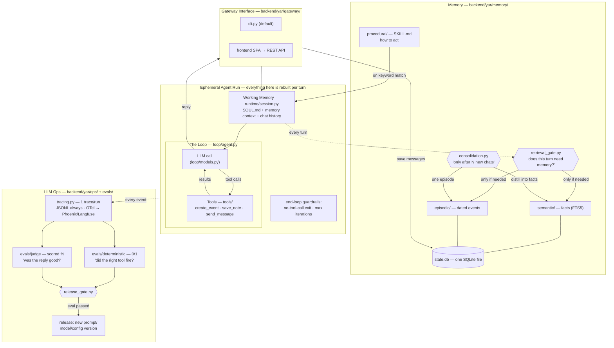

# yar-agent — Architecture

How the whole system works, deep enough to rebuild from scratch. Every fact is stated once.
For the concise overview and setup, see [README](../README.md); for the dashboard UI,
see [frontend.md](frontend.md).

The repo is a **backend** (Python agent + API server, managed with **uv**) and a **frontend**
(Vite + React SPA, managed with **pnpm**). This document covers the backend in depth and points
at the frontend doc for the UI.

Not a framework, not multi-agent, not production. It's the readable blueprint — the afternoon
read that explains how serious agents (OpenClaw, Hermes, …) are put together.

**One provider, two gateways, one store — two languages.** Yar talks to **OpenAI** only, is
driven from the **CLI** or the **SPA**, and keeps everything in **one SQLite file**. It must work
equally in **Persian and English** — a hard requirement with real consequences for keyword memory,
specified in [§7](#7-language-support-persian-and-english), not a later translation
pass. Alternate providers, gateways, and storage backends are deliberately out of scope — see
[§13](#13-deliberately-out-of-scope) for what was cut and where the seams are if you want it back.

---

## 1. The whiteboard (file path on every box)

The same Harness / Loop / Memory / LLM-Ops picture, with a concrete path on each box:



### The four pillars

| Pillar | What it does | Where it lives (backend/) |
|--------|--------------|---------------------------|
| **Harness / Gateway** | Move text in/out. No reasoning. | `yar/gateway/cli.py` + frontend SPA |
| **Loop** | LLM ↔ tools until a reply or max iterations. | `yar/loop/agent.py` (+ client in `models.py`) |
| **Memory** | Durable state: semantic, episodic, procedural + retrieval gate + consolidation. | `yar/memory/` + `yar/db.py` |
| **Eval / LLM-Ops** | Tracing, dashboard API, release gate, model compare, evals. | `yar/ops/` + `evals/` |

**Assembly flow** (`yar/app.py`):

```
Gateway (cli / SPA)
  -> Yar.respond()
      -> Session.build_system()      # SOUL + clock + gated memory + matching skills
      -> run_loop(client, tools)     # reason -> act -> observe
      -> Session.add_exchange()      # persist to chat_log
      -> Memory.consolidate_if_due() # every N exchanges -> facts + episodes
      -> Memory.export_markdown()    # mirror to .yar/MEMORY.md
  -> Tracer writes JSONL (+ optional OTel)
```

The backend is one Python package plus a stdlib HTTP server that exposes a REST API for the
Vite SPA (`VITE_API_BASE_URL`). Full route contracts: [api.md](api.md). There is no
separate web framework.

### Design decisions worth stealing

- **The gate before retrieval** (not retrieval on every turn): a cheap-model judge answers
  "does this message need the user's memory?" — saves latency and, more importantly, keeps
  irrelevant memories from biasing answers.
- **Consolidation is batched** ("after N chats"), asynchronous to the reply path, and
  loss-safe: if the summarizer fails, the chat log stays unconsolidated.
- **Deterministic evals and judge evals never mix.** One is a unit test, the other is a scored
  opinion. The release gate requires 100% of the first and a threshold on the second.
- **One of everything on the default path.** One provider, one wire format, one database, one
  gateway you can run with no extras. Every layer still has a documented seam (see §13), but a
  seam is a paragraph, not a second implementation.
- **One tokenizer for all human text.** Bilingual support isn't a translation table, it's a
  refusal to scatter ASCII assumptions: one `text.py` normalizes and tokenizes, everything else
  calls it (§7).

### What this deliberately is not

Not a framework, not multi-agent orchestration, not a production SaaS. Gateways only move
text; the loop stays ~95 lines; memory is one SQLite file. Complexity is welcome only when it
stays self-contained, tested, and keeps each pillar legible.

---

## 2. Backend package reference (`backend/yar/`)

### Root

| File | Purpose | Key symbols |
|------|---------|-------------|
| `__init__.py` | Package docstring + `__version__` | `__version__` |
| `__main__.py` | `yar` console entry; subcommand router | `main()` |
| `app.py` | Assembly diagram; wires everything together | `Yar`, `respond()`, `close()` |
| `config.py` | All knobs as env vars → dataclass | `Settings`, `load_settings()`, `ensure_home()` |
| `db.py` | SQLite schema + connection for `state.db` | `SCHEMA`, `connect()`, `_migrate()` |
| `text.py` | Persian/English normalization + the only tokenizer (§7) | `normalize()`, `tokens()`, `STOPWORDS`, `jalali()` |

### `yar/gateway/` — Harness

| File | Purpose | Key symbols |
|------|---------|-------------|
| `cli.py` | Terminal chat; live observer for gate/tools; `/memory`, `/quit` | `main()`, `_observer()` |

The SPA is the second gateway and needs no Python module of its own — it talks to
`ops/dashboard.py`.

### `yar/runtime/` — Working memory

| File | Purpose | Key symbols |
|------|---------|-------------|
| `session.py` | Per-turn system prompt (SOUL + clock + gated memory + skills) + history window | `DEFAULT_SOUL`, `Session.build_system()`, `add_exchange()`, `start_new()`, `switch()` |

### `yar/loop/` — The loop

| File | Purpose | Key symbols |
|------|---------|-------------|
| `agent.py` | THE LOOP: reason → act → observe, with two exit guardrails | `run_loop()`, `LoopResult`, `Observer` |
| `models.py` | OpenAI client construction + model defaults | `get_client()`, `DEFAULT_MODEL`, `DEFAULT_SMALL_MODEL` |

### `yar/tools/` — Tools

| File | Purpose | Key symbols |
|------|---------|-------------|
| `__init__.py` | Builds the default tool registry | `build_registry()` |
| `registry.py` | Tool dataclass + registry | `Tool`, `ToolRegistry` |
| `calendar.py` | Flagship `create_event` / `list_events`; writes `calendar.ics` | `make_tool()` |
| `notes.py` | `save_note` → facts | `make_tool()` |
| `messages.py` | `send_message` → `.yar/outbox/` | `make_tool()` |
| `search.py` | `search_web` via DuckDuckGo or Tavily | `make_tool()` |
| `memory_admin.py` | `manage_memory`, `update_soul`, `create_skill` | three `make_*_tool()` |
| `experimental.py` | Opt-in `delegate_task` + planned stubs | `make_delegate_tool()`, `PLANNED` |
| `mcp_client.py` | MCP bridge (async thread + sync tool calls) | `MCPBridge` |
| `workspace.py` | Dated folders for delegated coding runs | `new_run_folder()`, `autorun()` |

### `yar/memory/` — Memory

| File | Purpose | Key symbols |
|------|---------|-------------|
| `__init__.py` | Facade coordinating all memory | `Memory`, `REPO_SKILLS` |
| `retrieval_gate.py` | Hero #1: cheap model decides IF to retrieve | `should_retrieve()`, `GATE_PROMPT` |
| `consolidation.py` | Distill chat_log → facts + episode every N exchanges | `consolidate_if_due()`, `SUMMARIZER_PROMPT` |
| `semantic/store.py` | FTS5 keyword facts (BM25) | `SqliteFactStore` |
| `episodic/store.py` | Dated episodes (FTS + recency) | `SqliteEpisodeStore` |
| `procedural/loader.py` | Scan SKILL.md + keyword match | `Skill`, `SkillLoader` |
| `procedural/installer.py` | Install a skill from URL | `install()` |

### `yar/ops/` — LLM-Ops (API server for the SPA)

| File | Purpose | Key symbols |
|------|---------|-------------|
| `tracing.py` | JSONL traces (+ optional OTel) | `Tracer`, `compose()`, `iter_trace_lines()` |
| `dashboard.py` | Backend web server: REST API for the Vite SPA | `Handler`, `main()`, `collect()`, `chat()` |
| `release_gate.py` | `make gate`: run both eval suites | `run()`, `report()`, `main()` |
| `scoring.py` | Deterministic tool-call scorer for `dataset.jsonl` | `load_cases()`, `check_case()` |
| `judge.py` | 0–10 quality rubric for the compare arena | `judge_reply()` |
| `compare_history.py` | Model-arena scoreboard in its own JSONL (never `state.db`) | `append_run()`, `aggregate()` |
| `coding_eval.py` | Cross-model coding via delegated runner | `run_coding_case()` |
| `brief.py` | Morning briefing entry point | `main()`, `PROMPT` |
| `show_trace.py` | Terminal trace viewer | `render_trace()`, `main()` |

---

## 3. The loop (the whole trick)

`run_loop()` is the entire agent. One turn, in OpenAI `chat.completions` shape:

```python
messages = [{"role": "system", "content": system}, *history, {"role": "user", "content": text}]

for iteration in range(1, max_iterations + 1):
    response = client.chat.completions.create(model, messages, tools=tools.schemas())
    message = response.choices[0].message
    messages.append(message)
    if not message.tool_calls:
        return reply(message.content)          # guardrail 1: model talks to human
    for call in message.tool_calls:
        output = tools.execute(call.function.name, json.loads(call.function.arguments))
        messages.append({"role": "tool", "tool_call_id": call.id, "content": output})
# guardrail 2: hit max_iterations -> hard stop, never spin forever
```

- `messages` is mutated in place; after the call it *is* the traced working memory.
- The system prompt is `messages[0]`, rebuilt every turn — there is no separate `system` kwarg.
- Optional `stream=True` emits text deltas token-by-token (used by the dashboard chat dock),
  with a clean fallback to a single call for clients without streaming.
- An `Observer` callback lets gateways show tool calls live and lets tracing record them —
  without either being wired into the loop's logic.

### Working memory — system prompt assembly (`runtime/session.py`)

Rebuilt every turn. Order matters:

1. **`SOUL.md`** — persona (seeded once from `DEFAULT_SOUL` if missing). Rebrand as Yar; keep
   the rules: use `create_event` / `list_events` / `save_note` / `send_message`; trust memory;
   call each tool at most once per request; be honest about artifact paths; self-manage memory
   via `manage_memory` / `update_soul` / `create_skill`; **reply in the user's language**
   (Persian or English) while keeping tool arguments canonical (§7).
2. **Clock line** — `Right now it is {Weekday, YYYY-MM-DD HH:MM} ({TZ}, UTC±…) — {Jalali date}.`
   Both calendars, so a Persian request like «۵ مرداد» can be grounded (§7).
3. **Model identity** — model id + "local-first harness".
4. **Optional `Relevant memory:`** — only if the retrieval gate says retrieve.
5. **Optional `Relevant skill instructions:`** — matching SKILL.md bodies (see §6).

History window: last `history_turns` exchanges (default **12** → last **24** `chat_log` /
in-memory rows). Older turns stay in `state.db`; consolidation + the gate bring them back.

After each turn, `add_exchange` appends user + assistant. If tools ran, the assistant history
line gets a fold-in:

```
{reply}
[tools used: create_event({...}) -> ...; ...]
```

Without that line the model forgets it already acted and re-books the same meeting (the
triple-book regression). Persist to `chat_log` with `session_id`, `source`
(`cli`/`dashboard`), and optional `meta` JSON (`gate`, `iterations`, `latency_ms`, `tools`,
`model`).

Sessions are just labels on `chat_log` rows. `start_new` clears working memory; `switch`
reloads a past thread. Consolidation still reads **all** unconsolidated rows across sessions.

---

## 4. Model access (`yar/loop/models.py`)

**One provider (OpenAI), one wire format (`chat.completions`).** The `openai` SDK is the only
LLM dependency, and the loop speaks its shape natively — no adapter, no content-block
translation, no `PROVIDERS` table.

| Role | Default | Env override |
|------|---------|--------------|
| Loop model | `gpt-5.3-chat-latest` | `YAR_MODEL` |
| Small model (retrieval gate + summarizer) | `gpt-4.1-mini` | `YAR_SMALL_MODEL` |
| API key | — (required) | `OPENAI_API_KEY`, or `YAR_API_KEY` |
| Base URL | OpenAI default | `YAR_BASE_URL` |
| Request timeout | 120s | `YAR_LLM_TIMEOUT` |

`get_client()` fills the defaults and returns the SDK client. Fail clearly at startup when no
key is set — never fall back to a silent mock.

Model choice notes: prefer chat-completions model ids. **Avoid gpt-5.x *reasoning* ids here** —
they require `/v1/responses`, not `chat.completions`, and will error on the tool loop.

`YAR_BASE_URL` exists because many vendors serve an OpenAI-compatible endpoint. Pointing it at
one may work, but only OpenAI is supported and tested; see §13.

### Client quirks (must implement)

Without these, the tool loop breaks in production:

- Prefer `max_completion_tokens`; if the error mentions that param / `max_tokens`, retry with
  the other name only.
- Empty `choices` → raise a clear `RuntimeError`, don't crash on `choices[0]`.
- Streaming must reassemble incremental tool-call argument fragments (arguments arrive as
  partial JSON strings across deltas).
- Rate limits and refusals surface as readable errors, not tracebacks.

---

## 5. Tools

Tool shape: `Tool(name, description, input_schema, fn)`. `schemas()` emits OpenAI function
shape: `{"type": "function", "function": {"name", "description", "parameters"}}`.
Registered by default in `build_registry()`:

| Tool | Required args | Effect |
|------|---------------|--------|
| `create_event` | `title`, `start` (opt `end`, `attendees`, `notes`) | Row in `calendar_events` + `calendar.ics` |
| `list_events` | (opt `start`, `end`, `limit`) | Read local calendar |
| `save_note` | `subject`, `content` | Insert semantic fact (`source=user`) |
| `send_message` | `to`, `body` | Draft file in `.yar/outbox/` |
| `search_web` | `query` (opt `max_results`) | DuckDuckGo, or Tavily if `TAVILY_API_KEY` set |
| `manage_memory` | `action` ∈ search/update/delete | CRUD on facts/episodes |
| `update_soul` | `rule` | Append a learned rule to `.yar/SOUL.md` |
| `create_skill` | `name`, `description`, `body` | Write `.yar/skills/<name>/SKILL.md` |

Conditional tools:

- Memory-admin tools only if `memory` is wired.
- `YAR_EXPERIMENTAL=1` → `delegate_task` (+ planned `run_command`, `browse_web`, `schedule_task` stubs that honestly say "coming soon").
- `.yar/mcp.json` present (+ `[mcp]` extra) → one `<server>_<tool>` per MCP server; if the
  extra is missing, surface a clear ImportError message.

`create_event` is the **flagship teaching task**: the deterministic eval asserts on
`calendar_events` rows (+ ICS), in both Persian and English (§7). The calendar is **local only** —
a SQLite table plus an `.ics` file you can import anywhere. There is no OS calendar integration.

Dates and numbers: tools digit-fold their input via `text.normalize()`, then store **ISO 8601 /
Gregorian only**. Jalali → Gregorian conversion is the model's job (the clock line gives it both
calendars); an unparseable date returns an honest error instead of a guess.

Tools must return **honest** paths/errors — never fake success. Idempotency: re-booking the
same event should say "already exists", not double-insert.

---

## 6. Memory

### Data model (`yar/db.py` — one file, `state.db`)

| Table | Columns | Notes |
|-------|---------|-------|
| `calendar_events` | id, title, start, end, attendees, notes, created_at | Flagship-task artifact |
| `facts` | id, subject, content, source, created_at | Semantic memory; `source` = user \| consolidation |
| `facts_fts` | (FTS5 mirror of facts) | BM25 keyword search via triggers |
| `episodes` | id, happened_at, summary, created_at | Episodic memory |
| `episodes_fts` | (FTS5 mirror of episodes) | Keyword + recency search |
| `chat_log` | id, role, content, consolidated, session_id, source, meta, created_at | Raw log; consolidation reads here |

`connect()` runs `PRAGMA busy_timeout=3000`, applies the schema, then runs additive idempotent
migrations (SQLite has no `ADD COLUMN IF NOT EXISTS`). `check_same_thread=False` lets the
threaded dashboard server reuse one connection under a lock.

### The three memory types

All three live in `state.db` or on disk. No external services, no embeddings anywhere.

- **Semantic** — durable facts in `SqliteFactStore` (FTS5 / BM25 keyword search).
- **Episodic** — dated summaries of what happened, in `SqliteEpisodeStore` (FTS + recency).
- **Procedural** — `SKILL.md` how-to files on disk. See frontmatter + match rules below.

Facts and episodes are `text.normalize()`d on write, and every `MATCH` query is built from
`text.tokens()` — without that, keyword memory is English-only (§7).

### Procedural skills (SKILL.md)

Frontmatter (required — Anthropic Agent Skills shape):

```yaml
---
name: schedule-meeting
description: One sentence — what it does AND when to use it (these words are the trigger vocabulary).
---
```

Body: short markdown instructions (keep ~≤60 lines). Scan dirs: repo `skills/` +
`.yar/skills/`. Rematch when mtime signature changes. Template: `skills/TEMPLATE.md`.
Community skills: `skills/community/<name>/SKILL.md` (CI via `scripts/validate_skills.py`).

**Match algorithm:** tokenize the message and `(name + description)` with `text.tokens()` (Unicode
`\w`, minimum length 2, minus the bilingual stopword list — see §7); require overlap **≥ 2**; take
top `max_skills=2` by overlap. No embeddings. Descriptions carry Persian **and** English trigger
words.

### The two heroes

- **Retrieval gate** (`retrieval_gate.py`) — small model returns JSON
  `{ "retrieve": bool, "query": str, "reason": str }` (`max_tokens≈600`). If skip → no search.
  **Fails open:** parse/LLM error → retrieve anyway. Emits observer `gate` with
  `decision = skip | retrieve`. Fact `top_k` from settings (default 4); episodes often capped
  separately (e.g. 3).
- **Consolidation** (`consolidation.py`, facade `Memory.maybe_consolidate()`) — when
  unconsolidated `chat_log` rows ≥ `consolidate_every * 2` (default 6 → trigger at 12 rows),
  summarizer returns `facts[]` + one `episode` string, then marks rows `consolidated=1`.
  **Loss-safe:** on exception return 0 and leave rows unmarked. Asynchronous to the reply path.

After every turn, `Memory.export_markdown()` mirrors memory to `.yar/MEMORY.md`.

---

## 7. Language support: Persian and English

**Requirement: Yar must work equally well in Persian (فارسی) and English, including turns that
mix both.** This is not localization polish bolted on at the end — Persian breaks a keyword-memory
agent in specific, silent ways, so the rules below are part of the contract for the Memory and
Harness pillars. A build that chats in Persian but can't retrieve a Persian fact does not pass.

The failure mode to design against: **nothing errors.** ASCII-only tokenizers reduce Persian text
to an empty token list, so skills never match and searches return nothing, while every log line
looks healthy. See §14 for how this bites the reference implementation today.

### One normalization + tokenization module, used by every text path

`yar/text.py` is the single place that turns human text into tokens. Nothing else may tokenize.

**`normalize(text)`** — apply, in order:

| Step | Why |
|------|-----|
| Unicode **NFC** | Compose combining marks so equal-looking strings compare equal |
| Arabic → Persian letters: `ي`→`ی`, `ك`→`ک`, `ى`→`ی` | Persian text in the wild constantly uses the Arabic codepoints. They are *different characters* to SQLite: a query for `علي` scores **0 hits** against a stored `علی`. |
| Persian/Arabic-Indic digits `۰-۹` / `٠-٩` → ASCII `0-9` | So `ساعت ۹` and `ساعت 9` are the same token, and dates parse |
| Collapse `ﻻ`-style presentation forms, strip bidi controls (`U+200E/200F/202A-202E`) | Invisible characters otherwise split tokens |

**Do not strip ZWNJ (`U+200C`, نیم‌فاصله).** FTS5's `unicode61` tokenizer already treats it as a
separator, which is what you want: `جلسه‌های` indexes as `جلسه` + `های`, so both the stem and the
suffixed form match. Deleting it would fuse the word into `جلسههای`, which matches neither.

**`tokens(text, min_len=2)`** — `re.findall(rf"\w{{{min_len},}}", normalize(text).lower())`.
On Python 3 `\w` is Unicode-aware for `str` patterns by default, so it covers Arabic script and
Latin in one class with no flag needed. **An explicit ASCII character class (`[a-z0-9]`,
`[a-zA-Z0-9]`), or `re.ASCII` on a pattern that touches user text, is a bug** — that is the single
rule to remember from this section.

**Where normalization is applied:**

| Text | Normalized? |
|------|-------------|
| Facts and episodes, on write | **Yes** — they are searched text; canonical form must match canonical queries |
| Retrieval queries (from the gate) | **Yes** — same function, same result |
| Skill `name` + `description` and the incoming message, for matching | **Yes** (matching only — files stay byte-exact) |
| Tool arguments that become dates/numbers | **Yes** — digit folding before ISO parsing |
| `chat_log` content, `SOUL.md`, skill bodies | **No** — display + prompt text, stored verbatim |

### Consequences for each pillar

**Memory — skill matching (§6).** Tokenize with `text.tokens()`. Because Persian's most common
words are 2–3 letters (`با`, `به`, `در`, `از`), keep the overlap threshold at **≥ 2** but subtract
a small bilingual stopword list in `text.py`, or every message matches every skill. Built-in
skills **must carry Persian and English trigger words in their `description`** — that field *is*
the trigger vocabulary, so an English-only description is unreachable from a Persian message.
`scripts/validate_skills.py` warns when a skill has no Persian trigger.

**Memory — retrieval (§6).** `_fts_query()` builds `word OR word` from `text.tokens()`. Verified
behavior once it does: `unicode61` indexes and ranks Persian correctly, and ZWNJ splitting helps.
Note the asymmetry to watch for — an empty query makes `SqliteFactStore.search()` return `[]`,
but `SqliteEpisodeStore.search()` falls back to `recent()`, which *looks* like retrieval worked.

**Loop — prompts (§3).** `SOUL.md` gets a rule: **reply in the language the user wrote in**;
keep tool names and argument formats canonical (English tool names, ISO dates) regardless of
language. `GATE_PROMPT` and `SUMMARIZER_PROMPT` must state that input may be Persian, that JSON
keys stay English, and that the `query` / `facts[]` values must be written **in the language of
the source text** — a Persian conversation summarized into English facts is unretrievable from
Persian queries.

**Loop — clock line (§3).** Include both calendars, because a Persian user says «۵ مرداد»:

```
Right now it is Sunday, 2026-07-26 12:57 (Asia/Tehran, UTC+3:30) — ۱۴۰۵-۰۵-۰۴.
```

Jalali conversion is ~30 lines of integer arithmetic in `yar/text.py` (or `yar/calendars.py`) —
write it, don't add a dependency.

**Tools (§5).** `state.db` and `calendar.ics` store **ISO 8601 / Gregorian only** — one canonical
format, no dual-calendar columns. `create_event` digit-folds its input, then requires ISO; if it
receives an unparseable or ambiguous date it returns an honest error rather than guessing. The
model does Jalali → Gregorian conversion, which is why the clock line hands it both.

**Frontend.** Bidi and RTL rules live in [frontend.md §11](frontend.md#11-rtl-and-bilingual-ui-persian--english): `lang`/`dir`
on the document, per-message direction, logical CSS properties, Persian-capable system fonts.

### Evals (§8)

Bilingual behavior is covered by the deterministic suite, so `make gate` protects it:

- `evals/dataset.jsonl` carries a **Persian counterpart for every flagship case** (`id` suffix
  `-fa`), asserting the same `calendar_events` row from a Persian request.
- Unit cases for: normalization folding (`علي` → `علی`, `۹` → `9`), Persian skill match firing,
  a Persian fact **round-trip** (write → gate query → retrieved), and Jalali-plus-Persian-digits
  → correct ISO row.
- A mixed-script turn ("جلسه with Alex فردا") must behave.

---

## 8. Ops & Eval

### Tracing
- Always appends JSONL to `.yar/traces/<YYYY-MM-DD>.jsonl`. Events include: `turn_start`,
  `llm`, `tool`, `gate`, `consolidation`, `turn_end`, plus `config` (model switch), etc.
- Permanent token/cost ledger: `.yar/usage.jsonl` (never wiped by demo seed).
- Optional OTel: `OTEL_EXPORTER_OTLP_ENDPOINT` → Phoenix (`make trace`, :6006) or Langfuse.

### Dashboard API (`:7777`)
See **[api.md](api.md)** for the full route/payload contract. SPA details:
[frontend.md](frontend.md).

### Evals — never mixed

| | Deterministic (`evals/deterministic/`) | Judge (`evals/judge/`) |
|--|----------------------------------------|------------------------|
| Question | Did the right tool fire? | Was the reply helpful? |
| Scoring | 0/1 pass-fail (pytest) | 0–1 via DeepEval GEval (threshold 0.6) |
| API key | Offline: `ScriptedClient`; live: real key | Requires `OPENAI_API_KEY` |
| Run | `make eval` | `make eval-judge` |

**`evals/dataset.jsonl` case shape** (one JSON object per line):

```json
{
  "id": "schedule-basic",
  "input": "Schedule a coffee with Alex next Tuesday at 9am",
  "expect_tool": "create_event",
  "expect_in_args": {"title": "alex", "start": "T09:00"},
  "expect_min_tool_calls": 3,
  "setup_fact": {"subject": "alex", "content": "Alex prefers morning meetings"}
}
```

Scorer (`ops/scoring.py` — shared by shootout + Compare arena):

- `expect_tool: null` → pass only if **no** tools fired.
- Else expected tool must appear; each `expect_in_args` value is a **case-insensitive substring**
  of that arg.
- `expect_min_tool_calls` → `len(tool_calls) >= N`.
- Optional `setup_fact` seeds memory before the turn.

Offline helpers (`evals/helpers.py`): `make_yar(home, client=…)` isolates the `.yar` home so a
test never touches real memory. Live tier uses `OPENAI_API_KEY` (`HAS_KEY`).

- **Release gate** (`release_gate.py`, `make gate`): deterministic must be 100%, then judge if
  a key exists; write `.yar/eval_report.json` + append `.yar/eval_runs.jsonl`.
- **Compare arena**: races OpenAI model ids against each other; history in
  `.yar/compare/history.jsonl` (max ~50), isolated temp homes per contestant. `judge.py` scores
  0–10 (`YAR_JUDGE_MODEL`).

---

## 9. Configuration

### Defaults that matter

| Knob | Default | Notes |
|------|---------|-------|
| `YAR_MODEL` | `gpt-5.3-chat-latest` | Loop model |
| `YAR_SMALL_MODEL` | `gpt-4.1-mini` | Gate + summarizer |
| `YAR_MAX_ITERATIONS` | `10` | |
| `YAR_MAX_TOKENS` | **`8192`** | Headroom for long tool loops; not 2048 |
| `YAR_HISTORY_TURNS` | `12` | Sliding window (last 24 rows) |
| `YAR_CONSOLIDATE_EVERY` | `6` | Trigger when unconsolidated rows ≥ 12 |
| `YAR_RETRIEVAL_TOP_K` | `4` | Facts; episodes often separate |
| `YAR_HOME` | `.yar` | |

### Env vars (grouped; see `backend/.env.example`)

**On `Settings` (config.py):** `OPENAI_API_KEY` / `YAR_API_KEY`, `YAR_BASE_URL`, `YAR_MODEL`,
`YAR_SMALL_MODEL`, `YAR_HOME`, the loop/memory knobs above, `YAR_EXPERIMENTAL`,
`OTEL_EXPORTER_OTLP_ENDPOINT`.

**Read at call sites (not necessarily on Settings):** `YAR_LLM_TIMEOUT`,
`YAR_DELEGATE_TIMEOUT`, `YAR_JUDGE_MODEL`, `YAR_DASHBOARD_PORT` / `PORT`, `TAVILY_API_KEY`.

App code should still prefer `Settings` for anything on the dataclass; don't scatter new
`os.getenv` without a reason.

### `.yar/` runtime layout (gitignored)
```
.yar/
├── state.db              # facts, episodes, calendar, chat_log
├── calendar.ics          # exportable calendar
├── SOUL.md               # persona + learned rules
├── MEMORY.md             # generated human-readable memory mirror
├── usage.jsonl           # permanent token/cost ledger
├── eval_report.json      # latest gate verdict
├── eval_runs.jsonl       # gate history
├── traces/               # YYYY-MM-DD.jsonl per day
├── outbox/               # send_message + brief + delegate logs
├── skills/               # installed / agent-authored skills
├── compare/history.jsonl # model arena (NOT in state.db)
├── shootout/             # CLI shootout reports
├── models.json           # dashboard pinned models
└── mcp.json              # optional MCP server config
```

---

## 10. Entry points

Console script (`backend/pyproject.toml`): `yar = "yar.__main__:main"`.

| Command | Runs |
|---------|------|
| `yar` | CLI chat gateway |
| `yar dashboard` | Dashboard API on :7777 |
| `yar brief` | Morning briefing |
| `yar skill install <url>` | Install a procedural skill |

Makefile (from `backend/`, prefer via `uv run`): `make run · brief · dashboard · trace · eval ·
eval-judge · gate · shootout · shootout-coding · lint`.

Scripts: `scripts/demo_seed.py` (reset demo state, requires `--yes`, backs up first — **ask
before every run**), `scripts/shootout.py` (multi-model benchmark),
`scripts/validate_skills.py` (CI frontmatter check).

---

## 11. Dependencies

### Backend (uv)

- **Python**: `>=3.11`. **Build**: hatchling. **Package manager**: `uv` (`uv.lock`).
- **Core**: `openai>=1.50`, `python-dotenv>=1.0`, `rich>=13.0`.
- Install: `uv sync` · extras: `uv sync --extra eval` · run: `uv run yar`.
- **Optional extras**:

| Extra | Packages | For |
|-------|----------|-----|
| `eval` | pytest, deepeval | Judge evals |
| `tracing` | arize-phoenix, opentelemetry-sdk/exporter-otlp | OTel + Phoenix |
| `mcp` | mcp>=1.0 | MCP tool bridge |
| `dev` | pytest, ruff | Development |

### Frontend (pnpm)

Vite + React + TypeScript + Tailwind + shadcn/ui + React Router. Install with `pnpm install`
only (7-day minimum release age). No frontend test suite — verify with `pnpm tsc --noEmit`,
`pnpm lint`, and the browser. API client against [api.md](api.md).

---

## 12. Rebuild order (suggested)

1. `config.py` + `db.py` + `text.py` — settings, the single SQLite schema, and the
   normalize/tokenize helper (§7). Build `text.py` first; everything downstream calls it, and
   retrofitting it means rewriting every search path.
2. `loop/models.py` + `loop/agent.py` — OpenAI client (incl. quirks) and the while-loop.
3. `tools/registry.py` + `tools/calendar.py` — flagship tool + deterministic eval cases in both
   languages.
4. `runtime/session.py` — system prompt assembly (bilingual clock line) + `[tools used: …]`
   history fold-in.
5. `memory/` — stores, gate JSON contract, consolidation fail-safe, skill matcher (all on
   `text.tokens()`).
6. `app.py` — wire it all (`Yar.respond()` → loop → `add_exchange` → `maybe_consolidate`).
7. `gateway/cli.py` — first harness.
8. `ops/tracing.py` + `ops/dashboard.py` — observability + REST API ([api.md](api.md)).
9. `frontend/` — Vite + React SPA against that API ([frontend.md](frontend.md)).
10. `evals/` + `ops/release_gate.py` + `ops/scoring.py` — dataset.jsonl scorer; `make gate`.
11. Optional extras last: MCP bridge, `delegate_task`, compare arena.

---

## 13. Deliberately out of scope

Cut on purpose to keep the default path one-of-everything. Each entry names the seam where it
would reattach, so nothing here needs a rewrite to revisit — but none of it is built, stubbed,
or flagged today. **Don't add speculative hooks for these.**

| Cut | Seam if you want it back |
|-----|--------------------------|
| **Other LLM providers** (Anthropic, Gemini, DeepSeek, xAI, OpenRouter, Kimi, GLM, MiniMax) | `get_client()` in `loop/models.py`. Most vendors serve an OpenAI-compatible endpoint, so `YAR_BASE_URL` + a key gets you surprisingly far. A truly different wire format (Anthropic Messages content blocks) needs an adapter that converts to/from OpenAI `tool_calls` — that adapter is the whole cost, and it's why it isn't here. |
| **Anthropic-native wire format** | Same seam. The loop is OpenAI-shaped end to end (`role: tool`, `tool_calls`); a second format means a translation layer plus its own streaming reassembly. |
| **Voice gateway** (wake word, faster-whisper STT, Kokoro/`say` TTS, mic in the SPA) | `gateway/` package + one new route. The CLI already proves the harness only moves text, at a tenth of the code. |
| **Telegram gateway** | `gateway/` package. Same reasoning; also a network dep and a token to manage. |
| **Supabase pgvector semantic memory** | `SqliteFactStore` is the interface. Swap in a store with the same methods; the gate and consolidation don't care. |
| **Notion episodic memory** | `SqliteEpisodeStore`, same interface. |
| **OS calendar integration** (Apple Calendar sync, Apple Mail/Reminders/Notes tools) | `tools/calendar.py` writes `calendar.ics`; import that file into any calendar app. AppleScript bridges are macOS-only and can't be tested in CI. |
| **Languages beyond Persian and English** | Nothing blocks them — `text.py` is Unicode-wide, so most scripts tokenize fine for free. But only fa/en are specified, prompted for, and covered by evals (§7). Adding a third means letter-normalization rules and eval cases of its own. |
| **Jalali dates in storage**, and any translation layer | `state.db` and `.ics` are ISO 8601 / Gregorian only; conversion happens at the prompt boundary. Yar answers in the user's language — it never translates content between languages behind their back. |

---

## 14. Reference implementation

These docs are a **port guide**, not a standalone handoff. Behavior and contracts are
reverse-engineered from the working Waku source:

**[github.com/ShenSeanChen/waku-agent](https://github.com/ShenSeanChen/waku-agent)** —
described here as of `main` @ [`871c4ac`](https://github.com/ShenSeanChen/waku-agent/tree/871c4ac)
(2026-07-23).

Renames when porting: package `waku/` → `backend/yar/`, env prefix `WAKU_*` → `YAR_*`, runtime
home `.waku/` → `.yar/`, class `Waku` → `Yar`. Waku's `evals/` and `skills/` sit at the repo
root; in Yar they live under `backend/`.

### What this document specifies vs. what you must lift from source

Every *contract* is here — schemas, JSON shapes, control flow, failure modes. Several *literals*
are not, because they're long and load-bearing. Copy these rather than reinventing them:

| Missing here | Where it lives in waku-agent |
|--------------|------------------------------|
| **Prompt texts** — persona, gate, summarizer, judge rubric | `waku/runtime/session.py` (`DEFAULT_SOUL`), `waku/memory/retrieval_gate.py` (`GATE_PROMPT`), `waku/memory/consolidation.py` (`SUMMARIZER_PROMPT`), `waku/ops/judge.py` (`_RUBRIC`), `evals/judge/test_response_quality.py` (GEval `criteria`), `waku/ops/brief.py` (`PROMPT`) |
| **Full SQL DDL** — §6 lists columns; the FTS5 external-content tables and their five triggers are exact | `waku/db.py` (`SCHEMA`, `_migrate()`) |
| **Per-model token pricing** — every `cost` / `total_cost_usd` field in the API depends on it | price map in `waku/ops/dashboard.py` (hand-maintained, date-stamped against vendor pricing pages) |
| **The architecture SVG** — [frontend.md §8](frontend.md#8-architecture-diagram--live-animation) gives the rules, not the drawing | `waku/ops/static/js/diagram.js` (`archSVG()` + the `STAGE` map, kept in one module on purpose) |
| **Design token values** — [frontend.md §10](frontend.md#10-design-tokens-port-to-tailwind-theme) names them | `waku/ops/static/style.css` |
| **Eval cases** — §8 shows one case shape | `evals/dataset.jsonl`, `evals/coding.jsonl` (English only — add the `-fa` counterparts per §7) |
| **Built-in skill bodies + template** | `skills/schedule-meeting/`, `skills/weekly-brief/`, `skills/TEMPLATE.md` |
| **On-disk formats** — trace events, usage ledger, arena records, ICS, outbox drafts | `waku/ops/tracing.py`, `waku/ops/compare_history.py`, `waku/tools/calendar.py`, `waku/tools/messages.py` |
| **Build scaffolding** — dep pins, targets, env catalog | `pyproject.toml`, `Makefile`, `.env.example` |

### Known defects in the reference — fix during the port, don't copy

Waku is English-only in practice. Porting these lines verbatim silently breaks §7:

| waku code | Defect |
|-----------|--------|
| `memory/procedural/loader.py` — `re.findall(r"[a-z0-9]{3,}", …)` in `match()` | Persian tokenizes to `[]`, so overlap is always 0 and **no skill ever fires**. Replace with `text.tokens()`. |
| `memory/semantic/store.py` — `_fts_query()` uses `[a-zA-Z0-9]{2,}` | A Persian query reduces to `""`, so `facts.search()` returns `[]` **before touching the index**. Facts are stored and permanently unreachable. Note `episodic/store.py` imports the same helper and falls back to `recent()`, which looks like a successful retrieval. |
| No normalization anywhere | Arabic `ي`/`ك` spellings score 0 hits against Persian `ی`/`ک`. |
| `ops/static/index.html` — bare `<html>`, no `dir`/`lang`; `style.css` has no logical properties | Dashboard is LTR-only. |
| `evals/dataset.jsonl` | No Persian case. The existing `test_trace_encoding.py` / `test_skill_encoding.py` cover non-ASCII **I/O** (Chinese + emoji) but never **search**, which is why this went unnoticed. |

FTS5 itself is fine — `unicode61` indexes and ranks Persian correctly, and splits on ZWNJ. The
defect is entirely in the ASCII pre-filters above.

### Waku modules with no Yar counterpart

Do not port these — they implement what §13 cuts: `gateway/voice.py`, `gateway/telegram.py`,
`tools/apple.py`, `memory/semantic/supabase_store.py`, `memory/episodic/notion_store.py`,
`sql/init_supabase.sql`, and the multi-provider `PROVIDERS` table / `OpenAICompatClient` adapter
in `loop/models.py`. Their eval files go too (`test_apple_calendar.py`, `test_wake_word.py`,
`test_speakable.py`, `test_notion_episodes.py`, `test_episodic_store_switch.py`,
`test_providers.py`), along with the Apple-calendar override in `evals/helpers.py`.

Waku is MIT; its architecture diagram is CC BY-NC-SA 4.0 (see that repo's README).

---

Guiding bar: **clear, honest code a newcomer can follow — each pillar legible on its own.**
New scope is welcome when it stays self-contained, tested, and readable; complexity for its
own sake is not. OpenClaw and Hermes are the products; this is the afternoon read that
explains them.
